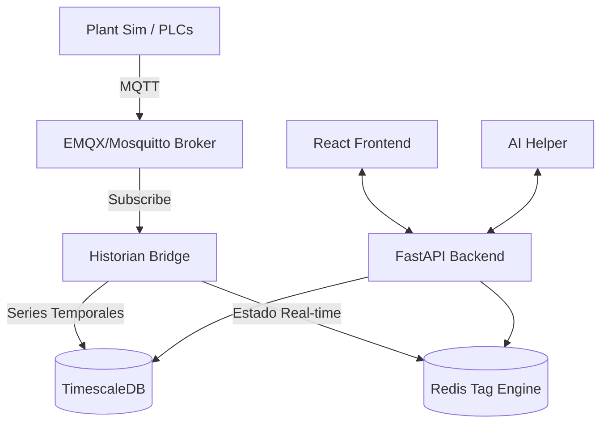

# SCADA Professional Overview 🚀

Este documento proporciona una visión detallada del sistema **SCADA Professional**, una plataforma moderna de automatización industrial diseñada para transformar datos de planta en información estratégica en tiempo real.

---

## 🏗️ Arquitectura del Sistema

El sistema utiliza una arquitectura desacoplada basada en microservicios, lo que garantiza alta disponibilidad y escalabilidad.



### Componentes Core:
1.  **MQTT Broker (EMQX)**: El "sistema nervioso" que transporta mensajes entre la planta y el software.
2.  **Redis (Tag Engine)**: Almacena el estado actual de cada variable (Tags) para acceso instantáneo.
3.  **TimescaleDB (Historian)**: Base de datos especializada en series temporales para el registro histórico masivo.
4.  **Historian Bridge**: Servicio que procesa los datos MQTT, aplica filtros (Deadbands) y los distribuye.
5.  **FastAPI Backend**: API de alto rendimiento que gestiona la lógica de negocio, alarmas y comunicación IA.
6.  **React Dashboard**: Interfaz moderna e interactiva para visualización y control.

---

## 🛠️ Stack Tecnológico

| Capa | Tecnología | Propósito |
| :--- | :--- | :--- |
| **Backend** | Python / FastAPI | Lógica de API y servicios en tiempo real. |
| **Frontend** | React / Vite / Recharts | Dashboard y visualizaciones dinámicas. |
| **Mensajería** | MQTT (Sparkplug B style) | Protocolo industrial liviano. |
| **Data Real-time** | Redis | Motor de Tags en memoria. |
| **Data History** | TimescaleDB (PostgreSQL) | Análisis de tendencias históricas. |
| **Inteligencia** | OpenAI / NLP Customs | Chatbot industrial para análisis de datos. |
| **Infraestructura**| Docker & Docker Compose | Orquestación y despliegue simplificado. |

---

## ✨ Características Principales

### 1. Tag Engine Jerárquico
Organización de datos en rutas lógicas (ej: `planta/area/equipo/sensor`). Esto permite una navegación intuitiva por los activos de la empresa.

### 2. Historian Automático
Registro inteligente de datos. Utiliza **Deadbands** para evitar guardar ruido y optimizar el almacenamiento, guardando solo cambios significativos.

### 3. Alarm Engine & Watchdog
- **Monitoreo constante**: Detección de valores fuera de rango.
- **Acknowledge**: Sistema de reconocimiento de alarmas por operarios.
- **Historial de Alertas**: Registro auditable de eventos críticos.

### 4. IA Industrial (SCADA Chat)
Un asistente de lenguaje natural integrado que permite hacer preguntas como:
- *"¿Cuál fue el promedio de temperatura del Tanque 1 ayer?"*
- *"¿Hubo algún riesgo de presión en la caldera esta mañana?"*

### 5. Sinópticos Web
Representaciones gráficas del proceso (P&ID) que se actualizan en milisegundos sin necesidad de refrescar la página.

---

## 🚀 Cómo Empezar

El sistema está completamente dockerizado. Para iniciar todo el ecosistema:

1. Asegúrate de tener **Docker** y **Docker Compose** instalados.
2. En la raíz del proyecto, ejecuta:
   ```bash
   docker-compose up -d
   ```
3. Accede al Dashboard en `http://localhost:5173`.
4. El simulador de planta actualizará los datos automáticamente para pruebas.

---

> [!NOTE]
> Este proyecto está inspirado en **Ignition**, pero optimizado para entornos web modernos y flexible para integraciones con IA.
